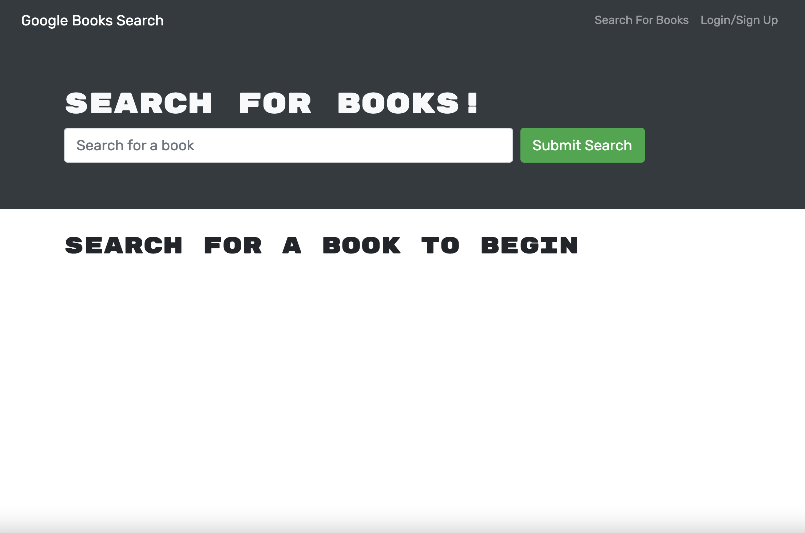
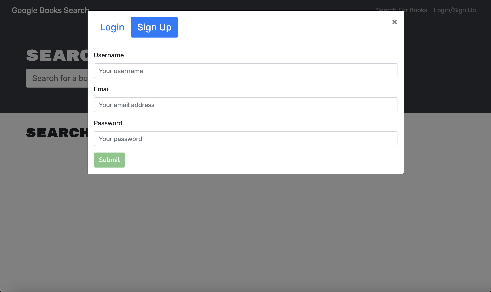
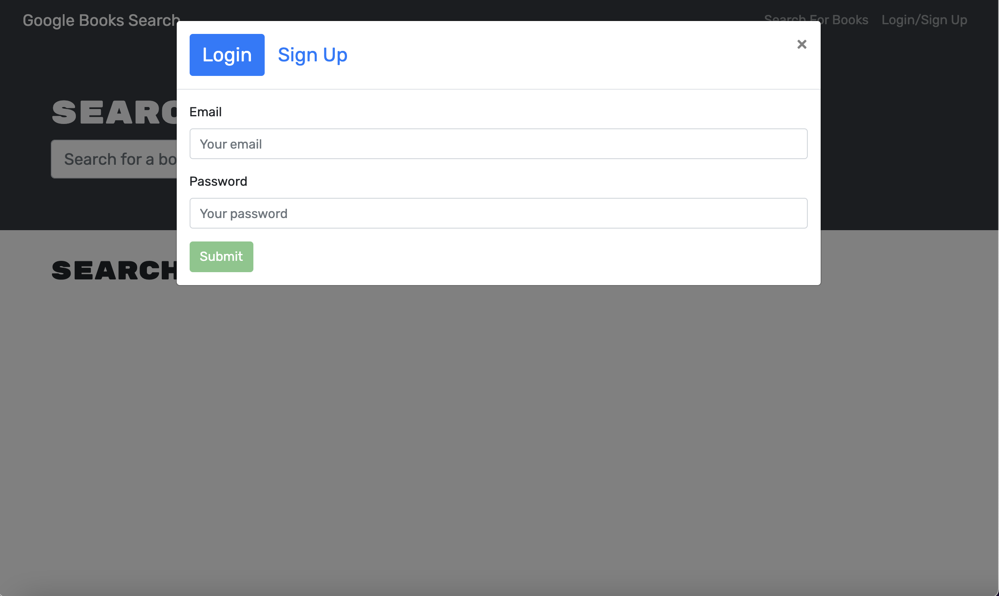
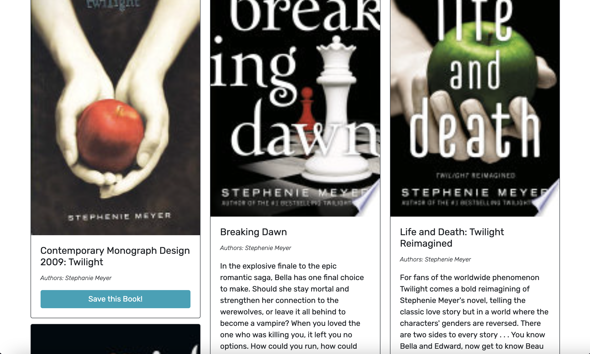
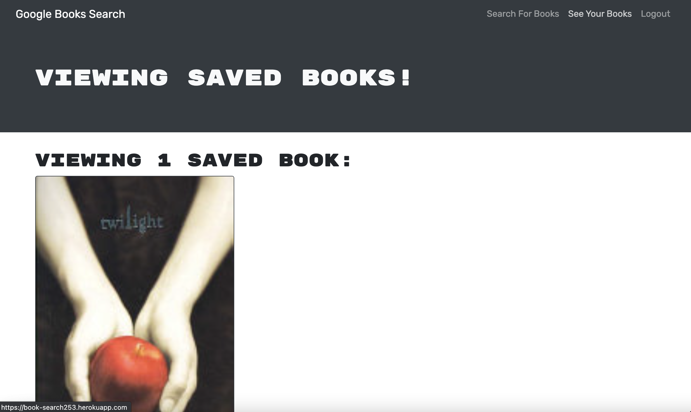

# Book Search Engine
> This app with allow you to signup, login and logout in order to be able to search books and ultimately save them to to your personal profile.
> Live demo [_here_](https://book-search253.herokuapp.com/). <!-- If you have the project hosted somewhere, include the link here. -->

## Table of Contents
* [General Info](#general-information)
* [Technologies Used](#technologies-used)
<!-- * [Features](#features) -->
* [Screenshots](#screenshots)
<!-- * [Setup](#setup) -->
* [Usage](#usage)
<!-- * [Project Status](#project-status)
* [Room for Improvement](#room-for-improvement)
* [Acknowledgements](#acknowledgements) -->
* [Contact](#contact)
<!-- * [License](#license) -->

## General Information
This app will allow the user to search for books based on Google's books API. When the user logs in, they will be able to save books that they want to read. When the user has found their book, they are able to delete it from their saved books page.
<!-- You don't have to answer all the questions - just the ones relevant to your project. -->

## Technologies Used
- Node.js 
- JavaScript 
- React 
- MongoDB
- Mongoose
- GraphQL

<!-- ## Features
List the ready features here:
- Awesome feature 1
- Awesome feature 2
- Awesome feature 3 -->

## Screenshots

<!-- If you have screenshots you'd like to share, include them here. -->

<!-- ## Setup
What are the project requirements/dependencies? Where are they listed? A requirements.txt or a Pipfile.lock file perhaps? Where is it located?

Proceed to describe how to install / setup one's local environment / get started with the project. -->

## Usage
Install dependencies:

`npm install`

Run build script:

`npm run build`

Start the app on your local machine:

`npm run develop`

<!-- ## Project Status
Project is: _in progress_ / _complete_ / _no longer being worked on_. If you are no longer working on it, provide reasons why.

## Room for Improvement
Include areas you believe need improvement / could be improved. Also add TODOs for future development.

Room for improvement:
- Improvement to be done 1
- Improvement to be done 2

To do:
- Feature to be added 1
- Feature to be added 2

## Acknowledgements
Give credit here.
- This project was inspired by...
- This project was based on [this tutorial](https://www.example.com).
- Many thanks to... -->

## Contact
Created by [Ryan DeGroot](https://github.com/degrootr253) - feel free to contact me!

<!-- Optional -->
<!-- ## License -->
<!-- This project is open source and available under the [... License](). -->

<!-- You don't have to include all sections - just the one's relevant to your project -->
